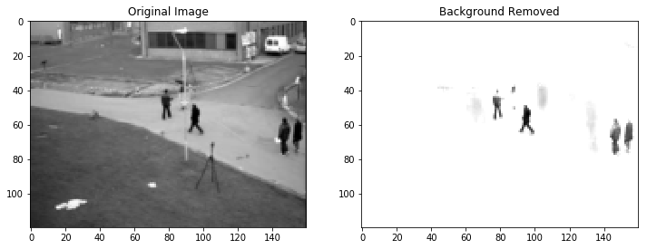

## [Video Background Removal with Singular Value Decompostion](/singular_value_decomposition)

This notebook shows the use of Singular Value Decomposition for the purpose of background removal from a survelliance video stream. The project idea originally comes from Rachel Thomas' FastAI course for 
[Computational Linear Algebra - Chapter 3](https://github.com/fastai/numerical-linear-algebra). The dataset comes from the [BMC 2012 Background Models Challenge Dataset](http://bmc.iut-auvergne.com/?page_id=24)

