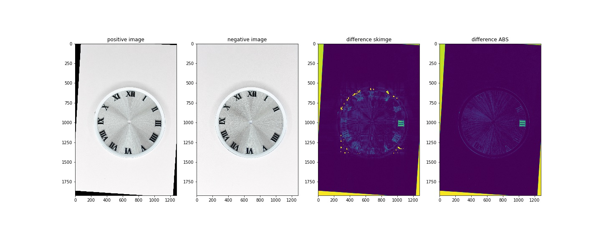
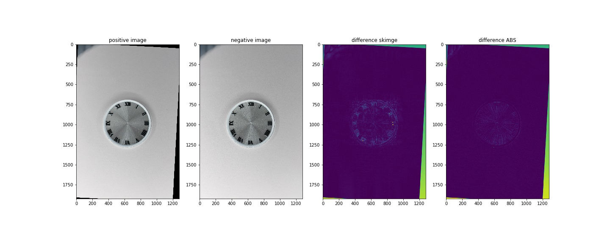

# Anomoly Detection for Watch Faces

This project was a proof of concept for a small watch company with the goal of using computer vision to detect errors in the manufacturing process of watches. An image is taken of a watch face and analyzed for errors in its design. These errors can include things like misplaced numbers, unwanted color variations, misalignment of features on the watch etc. 

#### Watch Face With Errors 


## Code 

The code layout is as follows:

```
Detector.py ------------------- Main Class for error detector and helper functions
show.py ----------------------- Quick script to visualize and step through the results
Detector_testing.ipynb -------- Jupyter Notebook for testing and additional documentation
Sample [X] -------------------- directory of testing images
```


## How it Works
My algorithm works by comparing a positive example of a watch pre-determined to be manufactured correctly with the new query watch. The images are aligned with OpenCV's SIFT Detector. Matches are filtered using a custom statistcal model based of a Gaussian Kernel Density Estimation of the SIFT transformation features. A Homography Transform is aligned so all of the watch features should line up, if both watches are identical. If the query watch has errors, they will become immediately visible by comparison. 

Once the two images are aligned, they are normalized and blurred (Gaussian) and subtracted from eachother to visualize the differences. These differences are highlighted for easy localization and detection. Future work of this project includes automation of a pipeline to capture the images and sort the watches. 

In the examples below, the top image shows a watch face with errors, denoted by the highlighted "III" which is missing. The second exmaple is a perfect watch and does not show this error.

#### Watch Face With Errors 


#### Watch Face Without Errors


